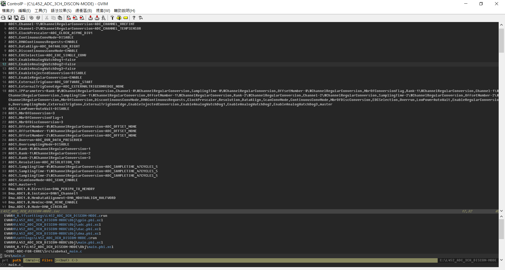
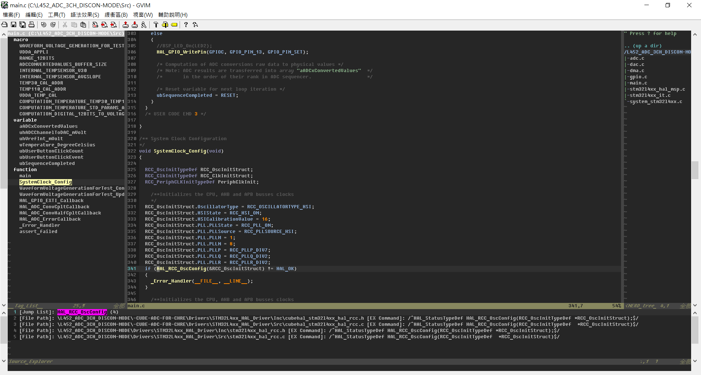
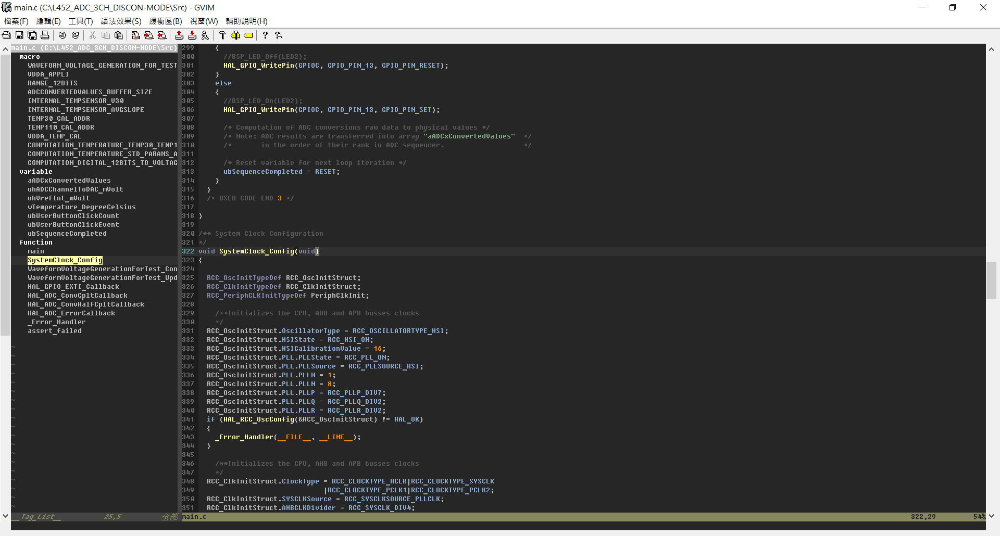
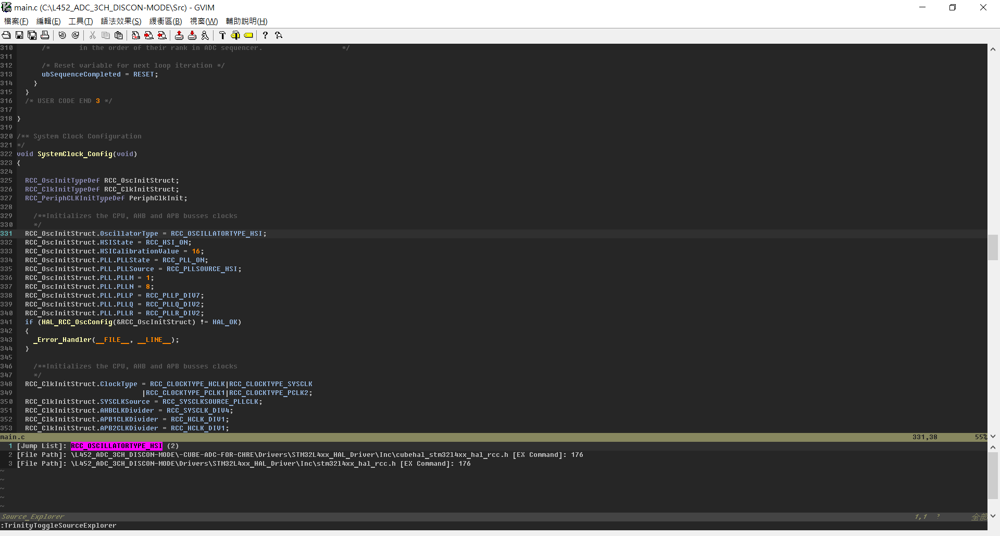
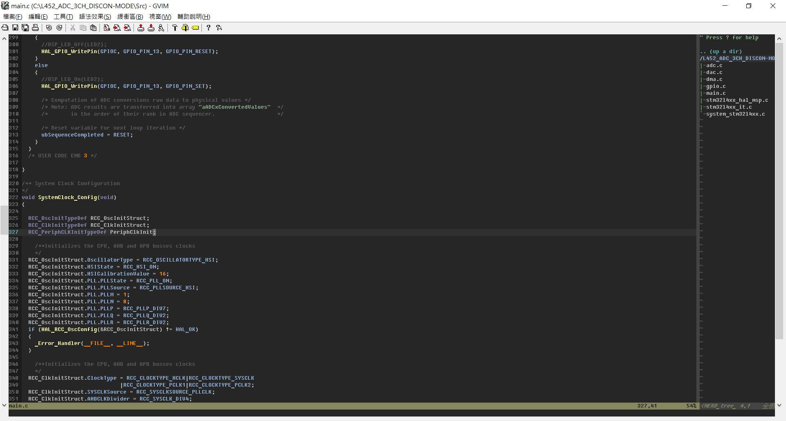
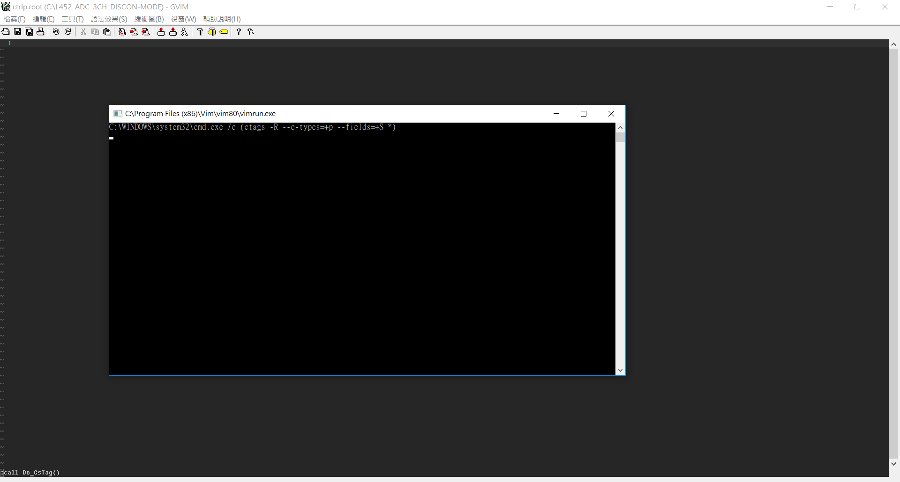
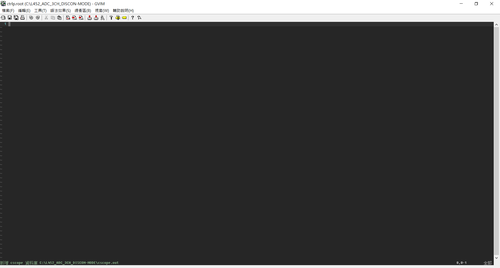
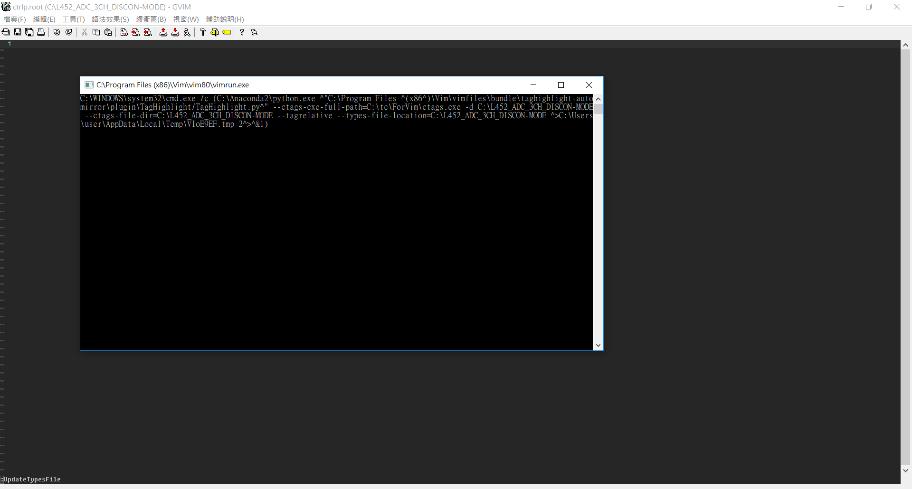

- This repository contains vimrc (_vimrc) as well as color theme (colors\).

- vimrc is tested over Win7-64/HP-8470p, Win10-64/HP-Spectre and Linux-raspberrypi-4.1.13-v7+/RPi2. 

- The following features are enabled:

	- ctrlp
		
    - Press F8 to enable TrinityToggleAll
        
    - Press F9 to enable TagList (TrinigyToggleTagList)
         
    - Press F10 to enable SourceExplorer (TrinigyToggleSourceExplorer)
        
    - Press F11 to enable NERDTree (TrinigyToggleNERDTree)
        
    - Press F12 to call Do_Cstag
        
        
    - Type :UpdateTypesFile in EX mode:
        

- Vundle is installed in the following path:
	- $VIM/vimfiles/bundle/Vundle.vim

		> For Windows, $VIM = C:\Program Files (x86)\Vim\
		> 
		> \> cd $VIM/vimfiles
        > \> git clone https://github.com/VundleVim/Vundle.vim.git ./bundle/Vundle.vim

		> For Linux
		> $ git clone https://github.com/VundleVim/Vundle.vim.git ~/.vim/bundle/Vundle.vim

	- Plugins managed by Vundle are placed in the following path:
		> For Windows, $VIM/vimfiles/bundle/
		> For Linux, ~/.vim/bundle